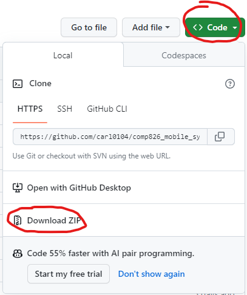
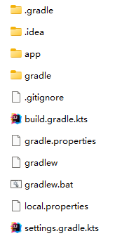
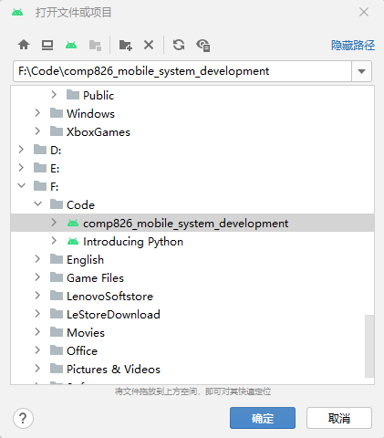
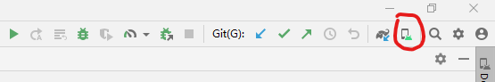
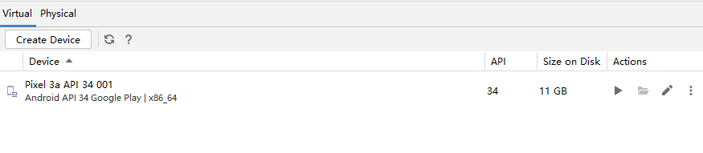

Milestone 2: Prototype, Evaluation, and Recommendations
======

Tsan Tsao  
Auckland University of Technology  
COMP826: Mobile System Development (2023-S2)  
Dr. Matthew Kuo  
October 29, 2023  

# 1. Downloading the Code
By clicking the links provided in the appendix, you can directly access the repository page.  
  
Click the green 'Code' button in the upper right corner, then select 'Download ZIP' to download the entire project's compressed file to your local machine.  
  
  
As shown in the above image, these are all the files inside the folder.  

# 2. Open the Project Using Android Studio
In the top left corner of the Android Studio interface, click on 'File', select 'Open...', navigate to the folder where the project is located, click 'OK', and the project will be opened.  
  

# 3. Download the Virtual Device
In the toolbar at the top right of Android Studio, select the icon indicated by the red circle (Device Manager) and click on it.  
  
In the development of this project, I chose Pixel 3a as the virtual device. In the device selection, choose 'Pixel 3a API 34' and download. This might take a while, depending on your network conditions.  
  
