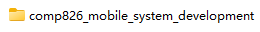

Milestone 2: Prototype, Evaluation, and Recommendations
======

Tsan Tsao  
Auckland University of Technology  
COMP826: Mobile System Development (2023-S2)  
Dr. Matthew Kuo  
October 29, 2023  

# 1. Downloading the Code
By clicking the links provided in the appendix, you can directly access the repository page.  
  
Click the green 'Code' button in the upper right corner, then select 'Download ZIP' to download the entire project's compressed file to your local machine.  
  
  
As shown in the above image, these are all the files inside the folder.  

# 2. Open the Project Using Android Studio

